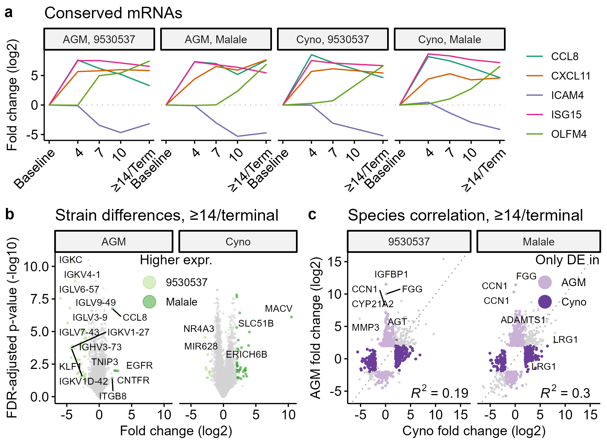
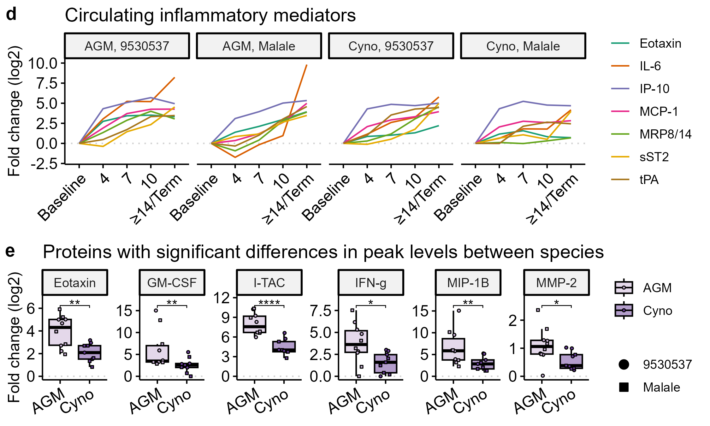

# Pathogenesis and natural history of Machupo virus infection in nonhuman primates: RNA-seq and LEGENDplex analyses

> Manuscript under review at mBio.

## RNA-seq methods
Total RNA was extracted from blood inactivated in TRIzol LS. Sequencing libraries were prepared following rRNA and globin mRNA depletion. Libraries were sequenced to 50M reads per sample in a 75x75 PE-read format on an Aviti machine. **Raw data were deposited in NCBI GEO ([GSE345290](https://www.ncbi.nlm.nih.gov/geo/query/acc.cgi?acc=GSE345290)).**

Raw reads were aligned to the combined host and viral genome via [`STAR v2.7.11b`](https://doi.org/10.1093/bioinformatics/bts635). PCR duplicates were masked with [`samtools v1.20`](https://doi.org/10.1093/bioinformatics/btp352) before quantification with [`featureCounts`](https://doi.org/10.1093/bioinformatics/btt656) from [`Rsubread v2.20.0`](https://doi.org/10.1093/nar/gkz114). **Logs from alignment and quantification are available in the [`logs`](logs) folder, and BASH scripts are provided.**

Analyses were performed with [`DESeq2 v1.52.0`](https://doi.org/10.1186/s13059-014-0550-8) in R v.4.6.1. **Code is available in [`rnaseq.r`](rnaseq.r), and outputs are available in [`rnaseq/`](rnaseq)**
1. **Longitudinal:** `~Daterange` Samples were segregated by species and MACV strain, binned by days postinfection (DPI), and compared to all pre-challenge baseline samples available for the given species. For example, AGM-Malale-4 DPI samples (n=5) were compared to all baseline AGM samples (n=10).
2. **Between strains:** `~Srain+Daterage+Strain:Daterange` Samples were segregated by species. Timepoints postinfection were compared between strains, controlling for differences from baseline.

## LEGENDplex methods
Circulating proteins in gamma-irradiated plasma were quantified using [LEGENDplex bead-based immunoassays](https://www.biolegend.com/en-us/immunoassays/legendplex) (Biolegend). Raw `.fcs` files were imported into [Qognit cloud-based Data Analysis Software](https://www.biolegend.com/en-us/immunoassays/legendplex/support/software) (BioLegend) which determined concentrations of experimental samples via 5-parameter logistic regression curve-fitting to each assay standard curve. Analyte concentration data was exported from Qognit and analyzed in R v4.6.1 using [limma v3.68.4](https://doi.org/10.1093/nar/gkv007). **Code is available in [`legendplex.r`](legendplex.r), and outputs are available in [`legendplex/`](legendplex)**

## Statistics
Statistical comparisons outside of those performed with `DESeq2` and `limma` were performed with [`rstatix v1.1.0`](https://rpkgs.datanovia.com/rstatix/). 

